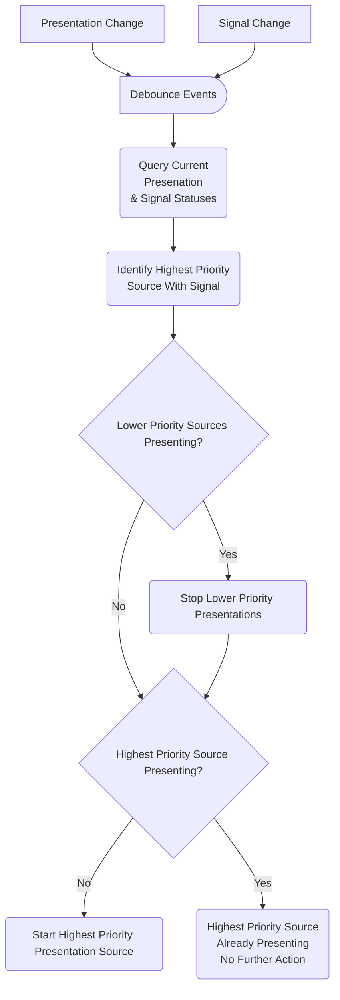

# Priority Presentation Macro

This is an example macro which ensure only one presentation is displayed on a Cisco RoomOS Device using on a configurable source priority order and video signal.


## Overview

Each time the Presentation or Video Input Connectors Signal statuses change, the macro will check which presentation sources are currently presenting and which video inputs have an 'OK' signal. The macro then determines which of the Video Inputs are the highest priority to display as the current presentation based on the macro config. Additionally, the macro can be configured to put the device to halfwake once no valid input source signals are detected.

For example:

If you config the macro with the following presentation sources:

```javascript
 presentationSourceOrder: [2, 3]
```

Then here would be the macros logic:

| Connector 2 Signal | Connector 3 Signal |     Result   |
| ------------------ | ------------------ | ------------ |
| "OK"               |        "OK"        | Present Source 2 |
| Not "OK"           |        "OK"        | Present Source 3 |
| "OK"               |        Not "OK"    | Present Source 2 |
| Not "OK"           |        Not "OK"    | Enter Halfwake (optional)   |


### Flow Diagram




## Setup

### Prerequisites & Dependencies: 

- RoomOS/CE 9.6.x or above Webex Device.
- Web admin access to the device to upload the macro.


### Installation Steps:
1. Download the ``priority-presentation-macro.js`` file and upload it to your Webex Room devices Macro editor via the web interface.
2. Configure the Macro by changing the initial values, there are comments explaining each one.
    ```javascript
    const config = {
      presentationSourceOrder: [2, 3],  // List of required presentation sources in order or priority
      noSignalAutoHalfwake: true,       // Automatically put the device in half wake when no presentation source signal is detected
      alert: {  
        showAlert: true,                // Show alert when switching from one old source to another
        alertDetails: {                 // Alert Details: https://roomos.cisco.com/xapi/Command.UserInterface.Message.Alert.Display/
          Duration: 30,
          Title: 'Auto Share Macro',
          Text: 'Unplug cable to restore previous presentation'
        }
      }
    }
    ```
4. Enable the Macro on the editor.
5. (optional) Set all Video Input Connectors Presentation Selection to ``Manual`` to avoid conflict with macro operations:

    [xConfiguration Video Input Connector[1] PresentationSelection](https://roomos.cisco.com/xapi/Configuration.Video.Input.Connector[1].PresentationSelection/)


## Demo

*For more demos & PoCs like this, check out our [Webex Labs site](https://collabtoolbox.cisco.com/webex-labs).


## License

All contents are licensed under the MIT license. Please see [license](LICENSE) for details.


## Disclaimer

Everything included is for demo and Proof of Concept purposes only. Use of the site is solely at your own risk. This site may contain links to third party content, which we do not warrant, endorse, or assume liability for. These demos are for Cisco Webex use cases, but are not Official Cisco Webex Branded demos.


## Questions
Please contact the WXSD team at [wxsd@external.cisco.com](mailto:wxsd@external.cisco.com?subject=priority-presentation-macro) for questions. Or, if you're a Cisco internal employee, reach out to us on the Webex App via our bot (globalexpert@webex.bot). In the "Engagement Type" field, choose the "API/SDK Proof of Concept Integration Development" option to make sure you reach our team. 
